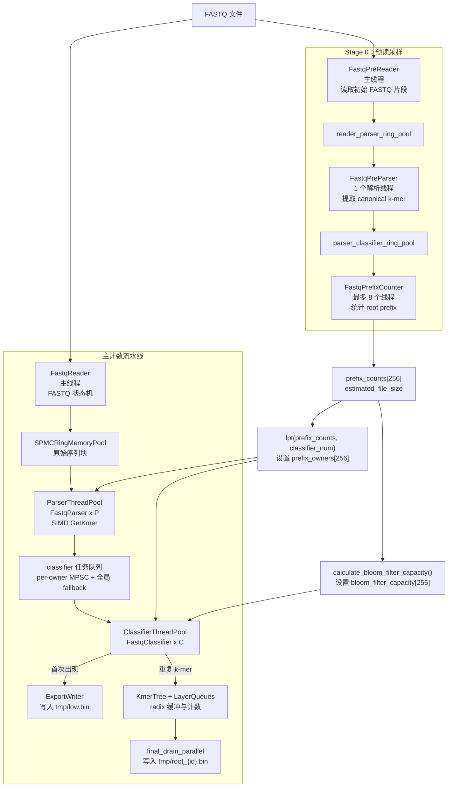
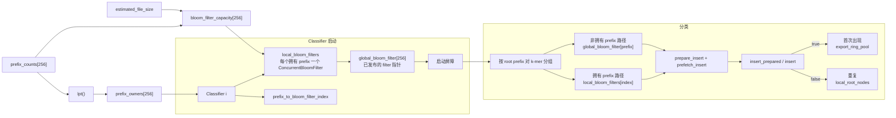
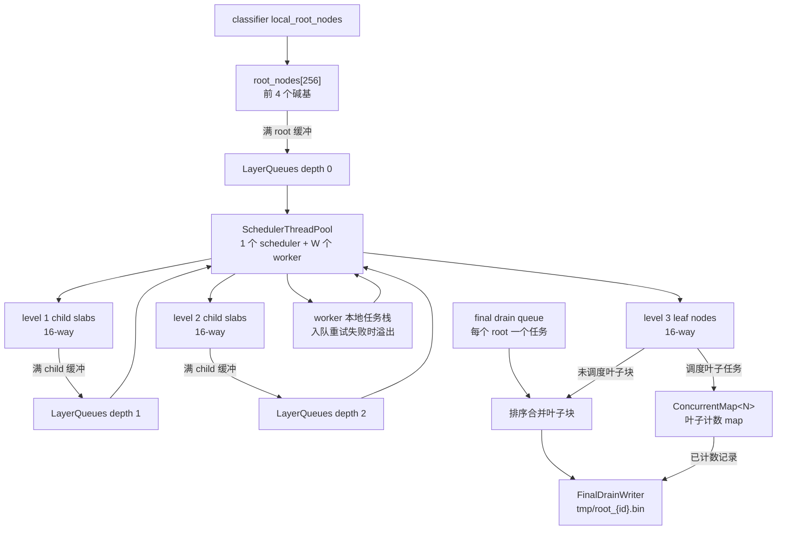

# tree_v4 - 高性能 K-mer 计数器

`tree_v4` 是一个面向 FASTQ 数据的 C++20、头文件为主、支持 SIMD 的 k-mer 计数器。当前流水线将 FASTQ 读取、SIMD k-mer 提取、prefix-owner 路由、Bloom filter 首次出现检测、radix tree 缓冲、自适应任务调度以及最终按 root 导出分成独立阶段。

实现围绕固定大小内存块、无锁或低竞争队列、NUMA 感知分配、root-prefix 负载均衡以及将首次出现的 k-mer 尽早从计数路径中移除进行优化。

## 架构概览

程序运行在两个主要阶段：

1. **Stage 0 预读采样** 读取初始 FASTQ 片段，提取 k-mer，统计 256 个 root prefix，通过 LPT 负载均衡将每个 prefix 分配给一个 classifier，并为每个 root prefix 确定一个 bloom filter 大小。
2. **主计数流水线** 读取完整 FASTQ 文件，将提取的 k-mer 路由到 classifier owner，导出首次出现，将重复 k-mer 送入 radix tree，并将所有剩余缓冲/计数状态导出到按 root 分文件的输出。



## Bloom 与 Prefix Ownership 流水线

最新的 bloom filter 设计基于 prefix-owner。Stage 0 为每个 4 碱基 root prefix 生成采样计数。`lpt()` 按采样计数对 prefix 排序并分配给 classifier 线程，使每个 classifier 获得相近的估计负载。`calculate_bloom_filter_capacity()` 根据文件大小估计总 k-mer 数，按采样 prefix 比例缩放每个 prefix 的容量，向上取整到 2 的幂，并强制不低于 `standard_bloom_filter_capacity`。

每个 `FastqClassifier` 仅为它拥有的 prefix 创建 `ConcurrentBloomFilter<N>` 实例。这些本地 filter 在启动屏障后发布到 `global_bloom_filter[256]`。分类期间，线程对拥有的 prefix 使用本地 filter，对非拥有的 prefix 使用已发布的全局指针。



## 主流水线

### Stage 0：预读采样

- `FastqPreReader<N>` 通过主读取器相同的 FASTQ 状态机读取初始 FASTQ 样本。
- `FastqPreParser<N>` 提取 canonical k-mer 并将 k-mer 块推入 `parser_classifier_ring_pool`。
- `FastqPrefixCounter<N>` 消费这些块并累积 256 个 root-prefix 计数器。
- 负载均衡和容量估计前，低于 1000 的计数会被提升，避免稀疏采样 prefix 产生过小的 bloom filter。
- `lpt()` 将 root prefix 分配给 classifier 并写入 `prefix_owners`。
- `calculate_bloom_filter_capacity()` 写入 `bloom_filter_capacity`。

### 主读取与解析

- `FastqReader<N>` 运行在主线程，将原始序列块推入 `reader_parser_ring_pool`。它通过 magic bytes 自动检测 `.gz` 输入并通过 `zlib` 流式读取。
- `ParserThreadPool<N>` 启动 `P` 个解析线程。
- `FastqParser<N>` 使用支持 SIMD 的 `GetKmer<N>` 在不进行 bloom 检查的情况下提取 canonical k-mer。
- 解析器使用 `prefix_owners` 将缓冲的 k-mer 按 classifier owner 分组。
- 解析器将 owner 特定的块加入 per-classifier `MPSCRingQueue`，必要时回退到 `global_classifier_task_queue`。

### 分类、导出与插入

- `ClassifierThreadPool<N>` 启动 `C` 个 classifier 线程并协调 `global_bloom_filter` 的启动屏障。
- 每个 `FastqClassifier<N>` 优先从私有队列消费，然后从全局 fallback 队列消费。
- Classifier 按 root prefix 重新分组每个块，检查正确的 `ConcurrentBloomFilter<N>`，并拆分为两部分：
  - 首次出现：缓冲到 `ExportBlock<N>` 并送入 `export_ring_pool`。
  - 重复：压缩到本地 prefix 组并累积到 per-thread `local_root_nodes`。
- 关闭时，每个 classifier 将本地 root 节点刷入全局 `KmerTree`，并标记一个 scheduler producer 完成。
- `ExportWriter<N>` 消费 `export_ring_pool` 并通过 `libaio` 双缓冲异步写将首次出现写入 `tmp/low.bin`，同时对每个 k-mer 进行 byte-pack（仅保留完整 64 位字和尾字节）以减少输出体积。

### 树调度与最终导出

`KmerTree<N>` 是一个 4 层 radix 缓冲树。root 层按前 4 个碱基索引，之后每一层消费 `NODE_BASES` 个碱基。节点缓冲固定大小的 `kmer_block<N>` 数组，直到需要下刷到更深层。



Scheduler 监控各深度的队列压力，将 worker 分配到不同深度，并允许 worker 处理本地溢出栈以减少队列竞争。`final_drain_parallel()` 随后遍历所有 root，在叶子已有 map 时插入剩余叶子块，或在无 map 时直接排序合并叶子块。

## 线程分配

线程数量在 `main.cpp` 中计算，要求 `n_thread >= 6`。

```cpp
parser_num = max(1, n_thread / 8);
worker_budget = n_thread - 2 - parser_num; // 去掉 reader 和 ExportWriter
classifier_num = max(1, worker_budget / (1 + TASK_CLASSIFIER_RATIO));
tasker_num = worker_budget - classifier_num;
```

默认 `TASK_CLASSIFIER_RATIO = 1` 时，worker 预算大致平分给 classifier 线程和 scheduler worker 线程。

主流水线活跃线程总数为：

```text
1 reader + parser_num + classifier_num + tasker_num + 1 ExportWriter = n_thread
```

Stage 0 在初始化期间还会启动 1 个 `FastqPreParser` 线程和最多 8 个 `FastqPrefixCounter` 线程。

## 组件映射

| 文件 | 作用 |
|------|------|
| `main.cpp` | CLI 校验、阶段编排、线程数计算、预读采样、prefix-owner 负载均衡、bloom 容量估计、流水线启动/合并、final drain、计时输出。 |
| `definition.h` | 共享常量与全局变量，包括 ring 容量、树深度参数、`Task<N>`、`ExportBlock<N>`、`prefix_owners`、`bloom_filter_capacity`、`global_bloom_filter`。 |
| `kmer.h` | 2-bit/碱基打包的 k-mer 表示及固定大小 k-mer 块。 |
| `GetKmer.h` | 带正反向双链状态的 canonical k-mer 提取，支持 SIMD 批量摄入。 |
| `FastqPreReader.h` | Stage 0 FASTQ 读取器，用于 prefix 采样和估计文件大小。 |
| `FastqPreParser.h` | Stage 0 解析器，将采样 k-mer 提取到 parser/classifier ring pool。 |
| `FastqPrefixCounter.h` | 按 256 个 root prefix 统计采样 k-mer。 |
| `FastqReader.h` | 主 FASTQ 读取器，处理 Header -> Sequence -> Plus -> Quality 状态机并输出块。自动检测 `.gz` 并通过 `zlib` 流式读取。 |
| `FastqParser.h` | 主解析器，提取 canonical k-mer，按 classifier owner 分组并分发 owner 特定块。 |
| `ParserThreadPool.h` | 启动解析线程，聚合解析计数器，并标记 parser/classifier producer 完成。 |
| `FastqClassifier.h` | 创建 per-owned-prefix `ConcurrentBloomFilter` 对象，发布 `global_bloom_filter` 指针，分类首次/重复 k-mer，导出首次出现，并将重复项缓冲到 local root 节点。 |
| `ClassifierThreadPool.h` | 启动 classifier 线程，协调 bloom filter 启动屏障，并在 classifier producer 完成时通知 scheduler。 |
| `BloomFilter.h` | 单线程 `BloomFilter<N>` 和并发 `ConcurrentBloomFilter<N>`，使用 XXH3 128-bit 哈希、3 个 bit probe、原子 `fetch_or` 以及 prepared probe/prefetch 辅助函数。 |
| `NewKmerTree.h` | Radix tree 缓冲、任务创建、worker 插入、叶子 map 创建、本地 root 刷新、final drain 以及按 `min_count`/`max_count` 过滤导出。 |
| `LayerQueues.h` | 按深度索引的 `MPMCRingQueue<Task<N>>` 队列，加上 final-drain 队列和原子队列大小统计。 |
| `SchedulerThreadPool.h` | 自适应 scheduler 与 worker 池，将深度队列下刷到更低树层或叶子 map。 |
| `ConcurrentMap.h` | `KmerTree` 使用的活跃叶子计数 map，基于 CAS 桶插入和原子计数更新。 |
| `ConcurrentCountingHashMap.h` | 面向 SIMD 的并发计数哈希 map 实现与测试目标，当前独立于 `KmerTree` 叶子路径。 |
| `CountingHashMap.h` | 保留用于本地聚合路径的线程本地计数 map 工具。 |
| `ConcurrentMemoryPool.h` | NUMA 感知块分配器，支持大块分配、线程本地缓存、大页支持/回退。 |
| `RingMemoryPool.h` | 固定大小 ring 内存池，包括用于 reader-to-parser 块的 SPMC 变体。 |
| `MPSCRingQueue.h` | 用于 per-classifier 任务队列的多生产者单消费者队列。 |
| `MPMCRingQueue.h` | 用于层队列和全局 classifier fallback 队列的多生产者多消费者队列。 |
| `ExportWriter.h` | 消费首次出现导出块，通过 `libaio` 对 `tmp/low.bin` 进行 byte-pack / 异步写入。 |
| `FinalDrainWriter.h` | 用于 `tmp/root_{id}.bin` 最终按 root 输出的缓冲写入器。 |
| `ExportReader.h` | 用于 byte-pack 导出低频文件的工具读取器。 |
| `SpinLock.h` | TATAS 自旋锁，带退避/yield 行为与测试模式计数器。 |
| `SpinBackoff.h` | 可复用的指数退避/yield/sleep 自旋等待辅助类，用于队列和内存池。 |
| `HashFunction.h`、`SplitMix.h`、`FixedStack.h`、`FixedMinHeap.h` | 支持哈希、随机化、栈和堆的工具。 |
| `tool/PostProcess.h` + `PostProcessMain.cpp` | 合并按 root 输出并排序/去重 `low.bin` 为 `final_low.bin` / `final_root.bin`。 |
| `tool/histogram_tool.cpp` | 以 `precise` 或 `approximate` 模式构建 k-mer 频次直方图（`freq_hist.txt`）。 |
| `tool/ApproximateHighFrequency.h` | histogram tool 在 approximate 模式下使用的高频计数线程池。 |
| `tool/HighFrequencyInsertThreadPool.h` / `LowFrequencyQueryThreadPool.h` | histogram tool 的 flat hash map 并发插入/查询 worker。 |
| `tool/FlatConcurrentHashMap.h` | histogram tool 背后的 SIMD 感知 flat 并发哈希 map。 |
| `tool/ExportReader.h` / `tool/FinalDrainReader.h` | 后处理工具用于读取 `tmp/low.bin` 和 `tmp/root_{id}.bin` 的读取器。 |

## 设计亮点

- **Prefix-owner 分类**：采样阶段在主流水线启动前将所有 256 个 root prefix 分配给 classifier owner，提升缓存局部性并减少跨线程随机 bloom 访问。
- **Per-prefix bloom 大小**：Bloom 容量与采样 prefix 频率和估计文件大小成比例，并设有最小标准容量。
- **Prepared bloom probe**：Classifier 在较大的 prefix 组上先准备 bloom 插入 probe 并预取目标 bin，再进行原子插入。
- **双路径 k-mer 流**：首次出现立即导出到 `tmp/low.bin`；重复 k-mer 继续进入 radix tree 计数。
- **队列感知解析**：解析器构建 owner 特定块并优先使用私有 classifier 队列，压力过大时回退到全局 fallback 队列。
- **全局树插入前本地聚合**：Classifier 将重复项缓冲到本地 root 节点，周期性刷入共享 root 节点以减少 root 竞争。
- **自适应树调度**：Scheduler worker 消费按压力评分的深度队列，并使用本地任务栈处理短期溢出。
- **NUMA 感知内存行为**：`ConcurrentMemoryPool` 使用大映射、per-node arena、线程本地块缓存以及友好大页分配路径。
- **固定大小块复用**：Reader/parser/classifier/export 路径通过 ring 内存池传递可复用块，而非每条记录分配。
- **压缩输入支持**：`FastqReader` 自动检测 `.gz` FASTQ 并通过 `zlib` 流式读取，避免显式解压到磁盘。
- **Byte-pack 低频导出**：`ExportWriter` 去除每个 k-mer 未使用的高字节，仅写入完整字加尾字节，减小 `tmp/low.bin` 体积。
- **统一自旋退避**：`SpinBackoff.h` 集中了队列和内存池使用的指数退避、yield 和 sleep 逻辑。

## 构建与使用

### 依赖

- C++20 编译器，已在现代 GCC/Clang 风格工具链上测试。
- CMake 3.10 或更新版本。
- POSIX 线程和实时库（`pthread`、`rt`）。
- 可选 `libnuma` 开发头文件以支持 NUMA。
- `zlib` 开发头文件/运行库，用于 `.gz` FASTQ 输入支持。
- `libaio` 开发头文件/运行库，异步导出写入器需要。
- 编译时按需使用 x86-64 AVX2 或 SSE4.2 支持。

### 构建

```bash
cmake -B build
cmake --build build
```

### 运行

```bash
./build/Tree <fastq_file> <k_len> <n_thread> <memory_limit_gb> [map_capacity] [min_count] [max_count] [parser_threads]
```

| 参数 | 说明 |
|-----------|-------------|
| `fastq_file` | 输入 FASTQ 文件路径。 |
| `k_len` | K-mer 长度。共享常量支持最大 `MAX_K = 128`。 |
| `n_thread` | 主流水线总线程预算。必须至少为 6。 |
| `memory_limit_gb` | 传递给 `ConcurrentMemoryPool` 的内存预算，单位为 GiB。 |
| `map_capacity` | 叶子计数 map 桶容量。默认：1024。必须大于 1 且小于 `16 * 1024 * 1024`。 |
| `min_count` | final drain 期间导出的最小计数。默认：1。 |
| `max_count` | final drain 期间导出的最大计数。默认：`uint32_t::max`。 |
| `parser_threads` | 用法字符串接受但当前 `main.cpp` 未应用；解析器数量由 `n_thread / 8` 推导。 |

### 输出

| 输出 | 含义 |
|--------|---------|
| `tmp/low.bin` | Classifier 通过 `ExportWriter` 直接导出的首次出现 k-mer（byte-packed）。 |
| `tmp/root_{id}.bin` | `final_drain_parallel()` 在叶子 map 导出或缓冲叶子块排序合并后输出的最终按 root 记录。 |
| `tmp/freq_hist.txt` | `histogram_tool` 生成的 k-mer 频次直方图（后处理）。 |
| `final_low.bin` / `final_root.bin` | `PostProcess` 合并、排序、去重后的最终输出。 |

### 后处理工具

`tool/` 目录包含操作 `tmp/` 下二进制输出的可选工具。

#### 频次直方图

```bash
./build/histogram_tool precise|approximate <tmp_dir> <k_len> <max_threads> <max_memory_gb> <output_file> [min_freq=1] [max_freq=10000]
```

生成 `freq_hist.txt`，每行格式为 `count\tnum_kmers`。`precise` 模式精确计数；`approximate` 模式使用 flat 并发哈希 map 以更快估计高频。


### 测试

```bash
ctest --test-dir build
```

当前 CMake 文件为活跃的并发 map 实现注册了测试。
